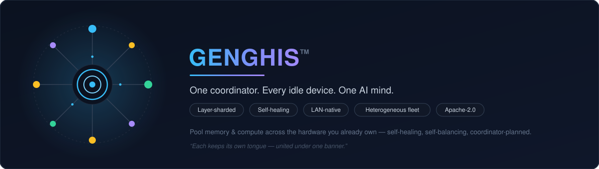
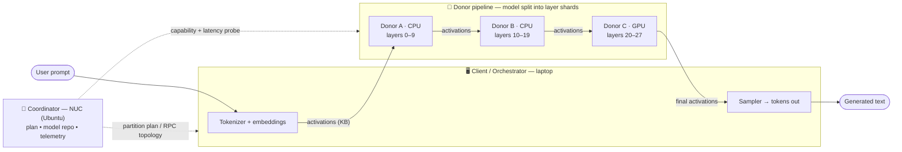
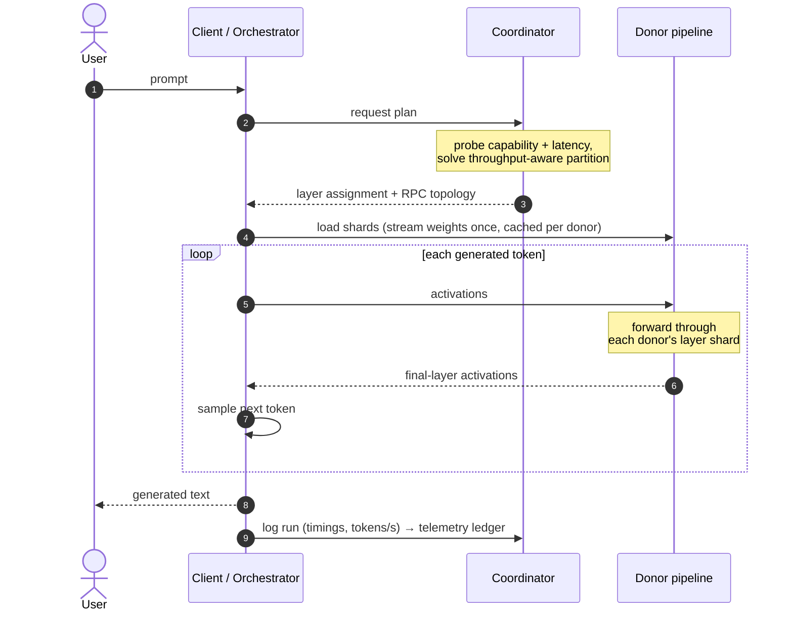

<p align="center">
  
</p>

# GENGHIS™

**Turn the idle devices you already own into one AI compute-and-memory pool.**

GENGHIS lets a modest client device (a laptop) borrow CPU/GPU and RAM from other devices on the local network — phones, tablets, Raspberry Pis, an old GPU box — and run AI models it could never hold alone. A dedicated **coordinator** plans *where each slice of a model runs* from each device's real capability and network latency, and heals that plan as devices come and go.

> Named for Genghis Khan: conquered peoples kept their own cultures, languages, and religions. GENGHIS lets each donor keep its own OS, architecture, and accelerator — ARM, x86, CUDA, whatever — unified under one coordinator without being forced to become the same.
>
> **And on "Protocol":** not a wire format — GENGHIS deliberately *reuses* llama.cpp's RPC rather than inventing one. It's a protocol in the older sense: the terms on which parties operate. Those terms are the line above.

**Sibling project — HEARTH** *(coming soon)*: the fabric's *face* — the **surface of "the Fold"** (the human↔digital membrane). A household client that renders the live GENGHIS fabric (and ambient surfaces) on the TV — HEARTH is its own product and will front several of ours; GENGHIS is its first backend — fed by the coordinator's [`serve`](docs/COMMANDS.md) endpoint; the TV **auto-discovers** the coordinator (mDNS) and **pulls its own config**. Born from GENGHIS's Tizen-TV work.

---

## Why now — the memory crisis

AI demand is pulling DRAM, HBM, and VRAM into datacenters; memory is scarce and prices are up. The usual answer to *"I need more memory to run a bigger model"* is **buy more** — into a shortage. GENGHIS answers differently: **you already own the memory — it's scattered across idle devices in your home.** Pool it instead of purchasing scarce new RAM. Reclaiming idle, already-owned memory is the near-opposite of the buy-more arms race.

---

## How it works

The winning idea isn't pooling a fungible quantity of "processing." It's pooling **memory** via **layer sharding**:

- A large model's layers are split across donors — each holds only its slice of the weights.
- During inference, small **activation vectors** (a few KB) stream device→device down a pipeline. This is latency-bound, not bandwidth-bound, so a good LAN (even WiFi 5) handles it well.
- The client only holds the tokenizer and sampling; the donors do the heavy compute.



GENGHIS stands on a proven transport (**[llama.cpp](https://github.com/ggml-org/llama.cpp) RPC** — the "muscle") and contributes the missing **"brain"**: a coordinator that

1. **Measures** each donor's throughput, free memory, accelerator, and link latency,
2. **Plans** a throughput- and latency-aware partition (load the strong nodes, *starve* the weak ones),
3. **Heals** — rebalances when a donor joins or drops,
4. **Serves & remembers** — hosts models once on the LAN and logs every run, so *"did smart placement beat naive?"* becomes a measured claim, not an opinion.

**The process, end to end:**



---

## Status

**Well past POC — a self-aware, self-healing cluster runs today.** From a modest laptop client, GENGHIS pools a heterogeneous fleet and runs models no single node could hold.

| Milestone | State |
|---|---|
| Client build (llama.cpp + RPC) | ✅ |
| Runs #1–2 — single- + two-donor pipeline split, naive baseline captured | ✅ |
| GPU donor — **RTX 5060 Ti (Blackwell)** *(GTX 1080 Ti retired — D4)* | ✅ |
| **Phase 2 — the v0.3 coordinator** (capability-aware plan, leave-one-out prune, precise KV from GGUF, self-tuning throughput) | ✅ |
| Self-healing (heartbeat · heal-by-membership · **settle-&-retry** on a transient shortfall) | ✅ |
| **Won't-fit demos** — a 32B (Run #7, 3.5×) then a **70B across the whole fleet** (Run #9) | ✅ |
| **The laptop's own RTX 5090 as the anchor** (M16 — a fits-model runs 100% local; overflow spills to donors) | ✅ |
| **Fleet unified** — one source of truth; nodes **self-report live capacity** (measure, don't assume) | ✅ |
| **Model repository on the authority** — `GET /models`, **HTTP-Range resume**, run a model **by name / fetch-if-missing** (1.5B/32B/70B staged) | ✅ |
| **Web admin + config** — name/manage nodes, default goal, PIN; featherweight (stdlib, no framework) | ✅ |
| **Zero-config mDNS discovery** — clients + the TV auto-find the coordinator (no hardcoded IP) | ✅ |
| **Auth (shared PIN) + Prometheus `/metrics`** — lockable coordinator; Grafana dashboard + "donor down" alert | ✅ |
| **OpenAI-compatible `/v1` API + [Open WebUI](https://github.com/open-webui/open-webui)** — chat the pool from any OpenAI client; **the always-on Pi can host inference itself** (laptop off) via a self-vantage fix (D17–D19) | ✅ |
| **Intel NUC 14 Pro** integrated — Arc iGPU via **llama.cpp Vulkan** RPC donor (~17.6 t/s) | ✅ |
| **Model registry + residency (D23)** — every local GGUF selectable in `/v1`, a user-set goal→model map, and a **warm `llama-server`** (switch models without re-loading GB — 32B ~15 s cold → ~2.8 s warm) | ✅ |
| **Control Room dashboard (D24)** — the live main page at `:8899/` (fleet · models · load/unload · a Local-Resources front-door hub with live status), Docker-free; **Open WebUI branded GENGHIS** | ✅ |
| **Docker = one optional labelled `genghis` project (D21)** + **first-run `genghis init`/scrub so the release ships none of our own data (D22)** | ✅ |
| **Role-based access (D25)** — proxy-forwarded identity → viewer/operator/admin; `/whoami`; local default, Azure/LDAP opt-in; drafted Cloudflare/oauth2-proxy overlays | ✅ |
| **Remote access — two front doors** — **Tailscale** (private, no domain, what we run) or **Cloudflare Tunnel + Access** (a login on your own domain, for people you won't put on your network); both keep every port closed | ✅ |
| **Home-base architecture (D29/D30)** — authority + home base as separate roles co-located by default; coordinator-replacement runbook **executed** (Pi → NUC, zero fleet downtime); the Docker UI tier lives once, on the home base | ✅ |
| **One authority, many hosts (D30) + self-registering nodes (D33)** — hosts read the fleet from the authority and forward writes; a box joins with one installer run | ✅ |
| **Watchdog** — an independent 15-min liveness pass; every Control Room shows *verified HH:MM · N/N nodes* | ✅ |
| **Dual-role nodes + Vulkan clients (D27)** — a box can be its own local anchor *and* an RPC donor for everyone else; Intel Arc / AMD boxes are first-class clients (`build-vulkan`, installer auto-detect, `-Donor`) | ✅ |
| **HEARTH** — the fabric's *face* / the Fold's surface, live on a real Samsung TV (sibling project) | ✅ |

**The keystone finding:** adding a weak donor via naive memory-split made generation *slower* (7.8 → 3.3 tok/s) — exactly the problem a capability-aware coordinator exists to solve. Confirmed again at scale (Run #10: benching the weak Tegra made a 70B run **3.25× faster**). See `poc/RESULTS.md`.

---

## The fleet (reference deployment)

| Device | Role |
|---|---|
| Windows 11 laptop — **RTX 5090 (24 GB, Blackwell)** | Client / orchestrator **+ the anchor compute node** (local `CUDA0`) |
| Raspberry Pi 5 (8GB, ~1TB) | Was the coordinator (2026-09-06→14); now a **CPU donor + the nightly cold spare** of the authority (full model library kept) |
| **RTX 5060 Ti (16 GB, Blackwell) in a Thunderbolt 4 eGPU enclosure, on the NUC** | Donor (CUDA) — served by the NUC's own `ggml-rpc-server` on a second port; **local-class** to that box (D46). Was a separate Ubuntu Server box until 2026-09-22; moving it onto the NUC took it from 38 t/s over 1 GbE to 228 t/s over Thunderbolt |
| Nvidia Tegra X1 (Jetson) | Donor (CPU) |
| Samsung UN50CU7000 smart TV | **SURFACE — the HEARTH face of the Fold** *(HEARTH coming soon)* (was a STORE node; the Pi is the repo now) |
| **Intel NUC 14 Pro** (Core Ultra 7 155H · Arc iGPU · 32 GB) — **Ubuntu 26.04 LTS** | **The authority + always-on home base:** fleet + config + **model repository** + web admin + HEARTH backend + mDNS + `/metrics` + watchdog; `/v1` host with residency; Arc/Vulkan donor — took over from the Pi ✅ |
| Raspberry Pi 4 (camera node) | **D20 task-fabric "eye" node** (camera pending) — not a compute donor |
| Linux x86 server · Pi 5 (4/2GB) · Pi 3 B | Donors — pending / deliberate "starve-me" test nodes |

Live measured specs live in [`poc/fleet.example.json`](poc/fleet.example.json) — kept current by **each node self-reporting** its capacity to the coordinator.

---

## The four roles (a box can hold any mix)
| role | owns | in the reference fleet |
|---|---|---|
| **Authority** | the truth — fleet, config, model library, mDNS, watchdog, HEARTH backend (one per fleet) | the NUC |
| **Host** | a front door — takes a chat, runs it on its own GPU, *hands it to the host that holds the model*, or pools over RPC | the NUC, the laptop |
| **Donor** | lends memory/compute over RPC | NUC (Arc), NUC's eGPU (5060 Ti), laptop, Pis |
| **Surface** | presence and sensing, no compute | the TV, the eye node |

Nobody is "the client". Work goes where the model lives; the authority is in charge of the *record*, not the work.

## What can be a donor?

The only real requirement: **run a Linux-style userland + the `ggml-rpc-server` binary for the device's CPU, and reach the LAN.** GPU acceleration is a bonus wherever a backend exists (CUDA/Nvidia, Metal/Apple, Vulkan/many). That gate opens a large share of the modern home — and the *always-on* devices (NAS, TV boxes, mini-PCs) are the most valuable, since they don't roam or sleep like phones do.


> ### 💡 The best donor is the one already gathering dust
> GENGHIS is really about **reclaiming under-utilized hardware** — devices you already own that sit idle almost all the time:
> - the **gaming PC** idle 16 hours a day, the **Mac mini** that only runs backups, the **NAS** ticking along at 5% CPU;
> - the **three old phones** in a drawer, the **retired laptop**, the **tablet** used twice a month;
> - the **smart TV** that's off 20 hours a day, the **VR headset** used for an hour on weekends, the **Steam Deck** between trips.
>
> None of this is a purchase. It's spare capacity you've *already* paid for — and the self-healing coordinator is built precisely so devices can come, go, and sleep without breaking the pool. That's the whole thesis: **not buy more memory — use the memory you're already wasting.**

**Works today — native:**
- **Linux** — desktops, servers, SBCs (Raspberry Pi, Orange Pi, Odroid, Jetson…)
- **Windows** — also the client
- **macOS** — Macs get the **Metal** GPU backend; first-class and fast (Mac Mini/Studio, MacBook, iMac)

**Feasible with a Linux layer:**
- **Android** phones & tablets — via Termux
- **Android TV / Google TV & Fire TV** — smart TVs, streaming boxes, **Nvidia Shield** (Tegra); Termux-sideloadable
- **VR headsets (Meta Quest)** — Snapdragon XR2, **6–12 GB RAM**, sideload-friendly Android; more capable than most phones
- **Home-automation hubs** (Home Assistant Yellow/Green) — Pi-class Linux, **on 24/7**
- **Chromebooks** — the built-in Linux container (Crostini)
- **Steam Deck / SteamOS** — Arch-based handheld with a capable APU (Vulkan)
- **NAS** (Synology, QNAP, TrueNAS) — run Docker; always-on, underrated donors
- **…and the long tail** — rooted robot vacuums (Valetudo), smart speakers/displays, set-top boxes/DVRs, even a jailbroken Kindle: technically donors, but weak and often intermittent — novelties for the story, not workhorses.

**Proven at the edge:**
- **Tizen (Samsung) smart TVs** — ✅ **DONE (D8), graduated from "aspirational."** A signed Tizen **.NET** app was sideloaded and runs on a **retail Samsung UN50CU7000** (Developer Mode + a DUID-bound Samsung cert + `sdb` over the LAN). Its role is the live **HEARTH** *(coming soon)* display **surface** — the face of the Fold — which now **auto-discovers** the coordinator (Tizen NSD) and **pulls its config**. Weak `armv7`/32-bit CPU + no usable GPU ⇒ *not* a compute donor; the model repository moved to the Pi, so the TV is no longer a STORE node (see [`DECISIONS.md`](DECISIONS.md) D8 → **D11**).

**Aspirational — locked platforms (would need a custom app or homebrew):**
- **iOS / iPadOS, tvOS** — no arbitrary binaries; only via a bespoke Metal app
- **webOS (LG)** smart TVs — writable but a homebrew port; weak hardware, no usable GPU.
- **Game consoles** — jailbreak territory

> The reference fleet above is where the protocol is proven today; this is the horizon it's designed to reach. Broadening the pool of "hardware people already own" is the whole point — see [`DECISIONS.md`](DECISIONS.md) for the per-platform reasoning as devices are evaluated.

---

## Quick start

GENGHIS has four roles — **authority** (fleet + config + model library; the always-on box), **host** (runs
`/v1` + warm models + a Control Room on its own GPU), **donor** (lends CPU/GPU to the pool), **surface** (a TV
that shows the fabric). One box can hold several: a one-box install is authority + host + donor. Ask two
questions of each machine — *is it always on? does it have a GPU?* — and the installers do the rest.

**1 · The authority (your always-on box — a Pi, a NUC, a server):**
```bash
git clone <this repo> ~/genghis-src && cd ~/genghis-src
bash install/install-linux.sh --role coordinator            # + --accel cuda|vulkan if it has a GPU
```
Control Room at `http://<authority-ip>:8899/`. Put your `.gguf` files in `poc/models/` — that is the fleet's library.

**2 · Every other box:**
```bash
bash install/install-linux.sh --role donor --accel cpu|cuda|vulkan --coord <authority-ip>   # Linux / Pi / DGX Spark
```
```powershell
powershell -ExecutionPolicy Bypass -File install\install-windows.ps1 -Serve -Donor -Coord <authority-ip>   # Windows (CUDA or Vulkan auto-detected)
```
Each installer **preflights, guides what it can't automate, builds llama.cpp at the pinned commit, registers the
box with the authority, and makes it reboot-proof** — the node appears in every Control Room on the next heartbeat.
Windows boxes that run `-Serve` become inference hosts: their own chat + Control Room, one shared fleet.

**3 · Use it:** open the Control Room, pick which model each speed setting runs, then chat from any OpenAI
client at `http://<host>:8899/v1` — or run the optional Docker tier on the host box:
```bash
docker compose up -d        # Open WebUI :3080 · Grafana :3000 · Prometheus :9090 — one copy, on the home base (D29)
```
Pick `genghis-fastest` … `genghis-biggest` as the "model"; the Thinking block shows what the fleet is doing.
From the CLI: `genghis_coordinator.py decide --goal biggest` prints the plan and *why*; `run` executes it with
self-healing. Full guides: [`INSTALL.md`](INSTALL.md) · [`USAGE.md`](USAGE.md) · [`docs/COMMANDS.md`](docs/COMMANDS.md).

> ⚠️ Every inference node must build the **same pinned llama.cpp commit** (RPC has no cross-version
> compatibility) — the installers pin it for you. `.gguf` in one folder per box; the authority's folder is the
> library others fetch from.

---

## Documentation

| Doc | What it covers |
|---|---|
| **[`install/`](install/)** | **Per-role preflight installers (D18)** — `install-windows.ps1` / `install-linux.sh`: detect → guide → build → register, idempotent, with a safe preflight/doctor mode |
| **[`INSTALL.md`](INSTALL.md)** | **The manual walkthrough** — per-platform steps (coordinator, donors, client, TV) + golden rules + troubleshooting (what the installers automate) |
| **[`USAGE.md`](USAGE.md)** | **Day-to-day** — run a model, the goal knob, view the fleet, HEARTH + check-ins, keep it healthy |
| [`docs/COMMANDS.md`](docs/COMMANDS.md) | Full command reference (every command, endpoint, env var) |
| **[`docs/MODELS.md`](docs/MODELS.md)** | **The one-folder rule** — drop GGUFs in a folder, pick which speed setting runs which, warm models (D23) |
| [`deploy/auth/README.md`](deploy/auth/README.md) | **Remote access + auth (D25)** — the two front doors (Tailscale · Cloudflare Tunnel/Access) & the oauth2-proxy overlay, group/email→role mapping *(reference; we run remote via Tailscale)* |
| [`CHANGELOG.md`](CHANGELOG.md) | **What changed, when** — dated revisions; DECISIONS holds the why |
| [`docs/SCENARIOS.md`](docs/SCENARIOS.md) | **What it is for** — two scenarios (one small host + a drawer of donors; a procedure of formations over Tailscale) every where-does-a-model-live decision is checked against |
| [`docs/LANDSCAPE.md`](docs/LANDSCAPE.md) | **Where GENGHIS sits** — exo, distributed-llama, GPUStack, Prima.cpp, CLUSTER, SharedLLM vs. the home task-fabric; what we have, what they have, positioning |
| [`docs/DGX_SPARK.md`](docs/DGX_SPARK.md) | **Onboarding an NVIDIA DGX Spark** — the 128 GB unified-memory node as a big donor or the always-on resident-model host |
| **[`INTEGRATION.md`](INTEGRATION.md)** | **Build your own endpoint** — connect a surface, client app, or donor; the standards-first API (OpenAI `/v1`, Prometheus, mDNS) + the three integration roles |
| [`PROJECT_CHARTER.md`](PROJECT_CHARTER.md) | Why + what we're building; the coordinator's three pillars; scope |
| [`DECISIONS.md`](DECISIONS.md) | Decision log with rationale (coordinator, licensing, min-WiFi, …) |
| [`poc/README.md`](poc/README.md) | POC runbook — donor setup, running splits, troubleshooting |
| [`monitoring/README.md`](monitoring/README.md) | Prometheus + Grafana — one-command dashboard & the "donor down" alert |

---

## License

Licensed under the **[Apache License 2.0](LICENSE)** — permissive, with an explicit patent grant. See [`NOTICE`](NOTICE). "GENGHIS" and "The GENGHIS Protocol" are reserved names of the project; the license covers the code, not the name.

© 2026 Michael B. Rinkus. Builds on [llama.cpp](https://github.com/ggml-org/llama.cpp) (MIT), invoked over RPC.
